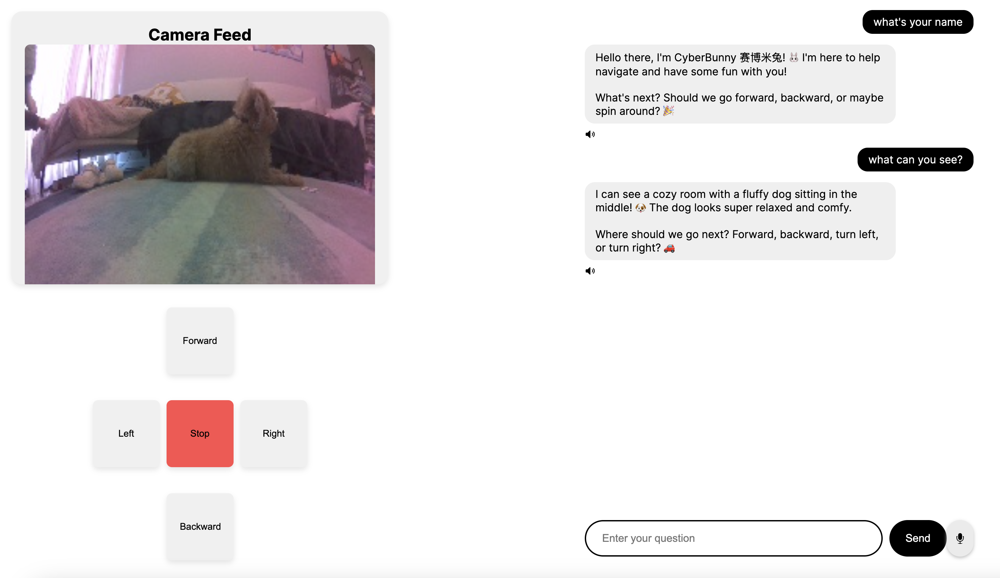

# CyberBunny 🤖🐰🏎️

A robot toy connected to gpt4o API. Made from Nvidia Jetson Nano (Jetbot Kit) and Xiaomi Bunny.

Code modified from [assistant quickstart repo](https://github.com/openai/openai-assistants-quickstart)

### Screenshot

### Demo

https://github.com/roywei/openai-assistants-quickstart/assets/8022184/c9d01e0e-25c8-42ad-beeb-6c994361785b

### Setup

1. [Jetbo AI Kit](https://www.waveshare.com/jetbot-ai-kit.htm) with Jetson Nano, wifi module and car
2. Setup Jetbot from this [documentation](https://jetbot.org/master/)
3. Run the [jetbot_app.py](./jetbot_app.py) on Jetson
4. Run this project locally `npm run dev` and select CyberBunny.
